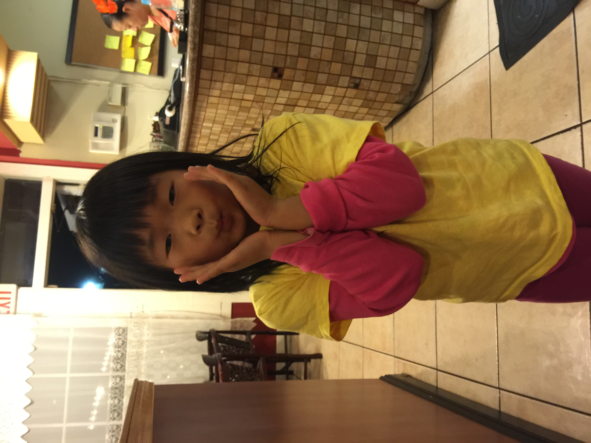

# Welcome to Allison's Atmosphere! 

### A Little Bit About Me

I am currently a sophomore at UCSD! I love to play tennis

* Warren is my college (which I did happen to choose)
* Computer Science is my major (which I can hopefully survive)

I have a sister, a *younger* sister to be specific. Her name is **Amber**, and we are ***TWO*** whole years apart. 

> My sister does NOT look like me and I do not look like her. 
>
>> It's odd because my sister looks like our dad, but I don't look like our mom, rather I look like our dad's mom, and my sister looks more like our mom's mom. Interesting how genes work. 

If you really insist on learning how to display my sister's lovely name, simply type `printf("Amber"); ` in your code editor (such as VS Code) in your .c file! Easy peasy!

Now let's get to the good stuff. I'll kindly grace you with a link to a really good, incredibly scrumptious [chocolate chip cookie recipe](https://joyfoodsunshine.com/the-most-amazing-chocolate-chip-cookies/ "one of the best recipes"). What can I say except... 

you're welcome :p

Now, here is a great time to go back to my life story and refresh yourself on cool information about me (if you so desire). [Click here to teleport!](#a-little-bit-about-me) 

How cool. 

Now back to my wonderful pet -- sorry I mean sister. If you were curious what she looks like or you wanted to get a visual depictment of her, you're in luck. 

[here's another file](extra.md)

Our top favorite foods are: 
1. Pasta 
2. Sushi
3. Sandwiches (shout out paninis)
4. Chicken Caesar wraps
5. Ice creeeam

Now, some of our favorite hobbies in no particular order: 
- Hiking 
- Going to the beach 
- Baking
- Playing piano

Now importantly, some things we both need to get on: 

- [] Finish washing our laundry 
- [] Help each other find a job 
- [] Get a doggie

## Thank you for listening to the story of our lives. We appreciate your time and care. Take care!